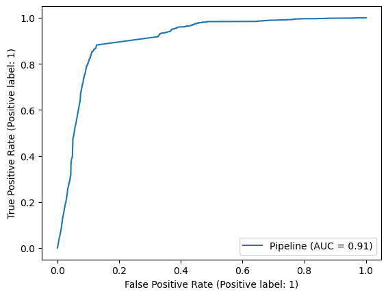
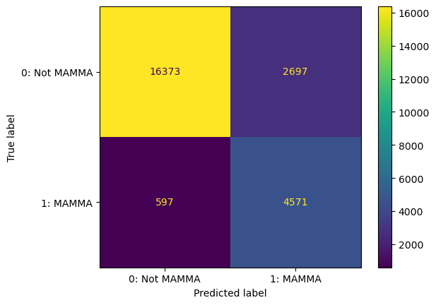
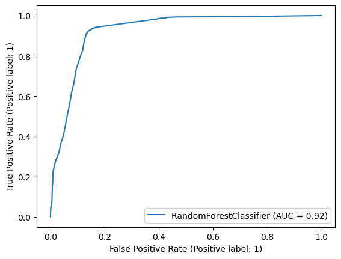
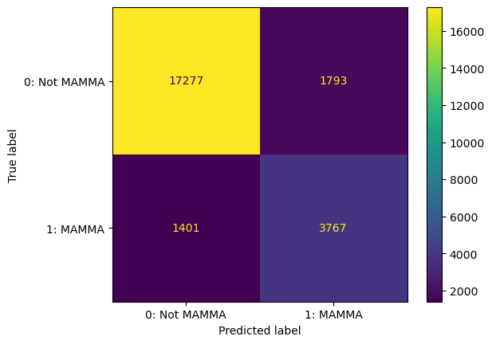

## Overview

This project uses NLP and Binary Classification to predict whether a tweet is regarding an MAMAA stock (one of the top 5 tech companies) or not, to measure social media engagement. With this data, it can also be assessed if Twitter is an effective platform for an a MAMAA company for audience interaction. <a href="https://www.forbes.com/advisor/investing/faang-stocks-mamaa/" target="new">MAMAA</a> consists of: Meta, Apple, Microsoft, Amazon, Alphabet. It was initially known as FAANG.

The sourced <a href="https://www.kaggle.com/datasets/equinxx/stock-tweets-for-sentiment-analysis-and-prediction" target="new">Kaggle</a> dataset contains over 64,000 tweets for the top 25 most watched stock tickers on Yahoo Finance for the fiscal year of 2022.

NLP preprocessing used: TweetTokenizer, stopwords, SnowballStemmer, Transformer for emoji, TF-IDF Vectorizer, and Count Vectorizer.

Non-negative matrix factorization produced the follow 5 top topics:
1. Tesla Stock Performance
2. Overall Markets
3. Semiconductors
4. Trading
5. Amazon Stock Performance

t-SNE visualization:

This dataset is imbalanced due number of non-MAMAA stocks. Most of that category is weighed by Tesla. We can make a guess that this due to the
timing when this dataset was scrapped as the news cycle in this time period was Elon Musk considering buying Twitter and its purchase.

Count Vectorizer + Complement NB is the best NB model due to class imbalance of this dataset. Predicts with 86% accuracy and a false positive rate of ~11%.

Random Forest predicts with 87% accuracy and a false positive rate of ~7%.

## Conclusion
Random Forest was the best model as it had an increase in 1% accuracy compared to the best NB model.

Dataset may need the current year tweets for better insight. Twitter appears to not be the best social media platform for MAMAA stock engagement.
